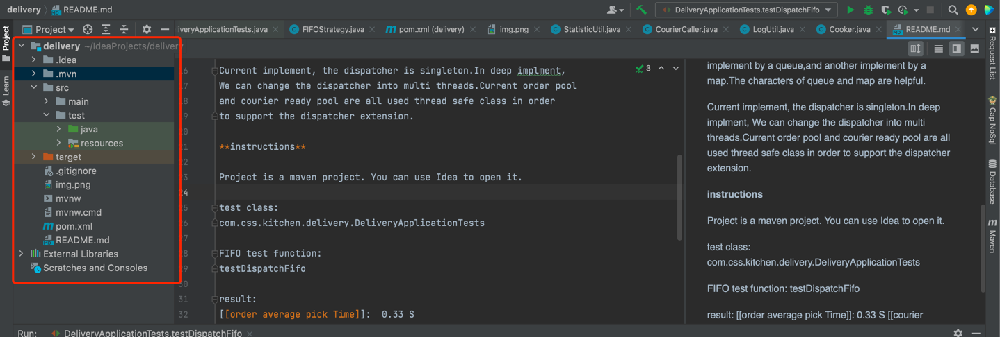

# Delivery orders for a kitchen implement detail

**Design detail**

I abstract some class,called dispatcher;prepared order pool,waiting
courier pool,cook service,courier caller.The dispatcher, which like a service
bar in a cafe, listens to the order requirement, watches is there any prepared
cook order int order pool and available courier in courier pool.In order to meet
the two dispatch strategies from the task,I use strategy design pattern and designed
two strategies called FIFO strategy and matched strategy.Matched up with the two
strategies,I design two courier pools, one implement by a queue,and another implement
by a map.The characters of queue and map are helpful.

Current implement, the dispatcher is singleton.In deep implment,
We can change the dispatcher into multi threads.Current order pool
and courier ready pool are all used thread safe class in order 
to support the dispatcher extension.

**instructions**

Project is a maven project. You can use Idea to open it.
language: java
jdk: jdk 8
 

implement detail under the main package.

test entrance under the test package.

test class:
com.css.kitchen.delivery.DeliveryApplicationTests

FIFO test function:
testDispatchFifo

result:
[[order average pick Time]]:  0.33 S
[[courier average wait Time]]: 0.52 S

MATCHED test function:
testDispatchMathced

result:
[[order average pick Time]]:  5.48 S
[[courier average wait Time]]: 5.96 S

